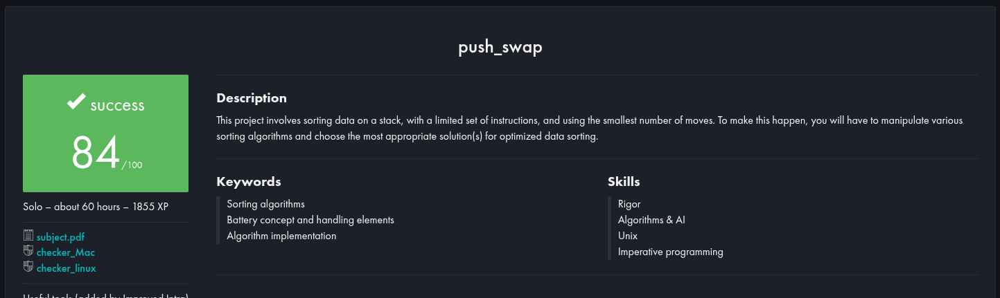

# 42 - Push_Swap

[](https://www.42porto.com)
[](https://en.wikipedia.org/wiki/C_(programming_language))
[](https://projects.intra.42.fr/)

## About

> Sorting Algorithms

This project is part of the 42 curriculum and seeks to sort a list of integers with the **least possible number of operations** using **only two stacks (stack A and stack B)** and a limited set of instructions.

Push_swap is an excellent exercise for consolidating knowledge about:

- Sorting algorithms
- Optimizing operations
- Algorithmic complexity analysis
- Low-level implementation using C

## Evaluation



## Testing

- [gemartin99/Push-Swap-Tester](https://github.com/gemartin99/Push-Swap-Tester)
- [hu8813/tester_push_swap](https://github.com/hu8813/tester_push_swap)


## Instructions

### Compiling

To compile my code, you can do `make` in the terminal. It will create the program.

```bash
make
```

This will generate the binary `push_swap`.

### Usign the Code

To try out the program, just run it on your Linux Terminal, and give it some arguments, for it. It will only accept numbers as a response, as requested in the project statement. You can use `./push_swap "0 2 5 9 4"` as well as `./push_swap 0 2 5 9 4`, as my code is prepared for this!

```bash
./push_swap 0 2 5 9 4
```

The output will be the moves that the algorithm has made in order to organize the stack in an increasing order. These moves and this way of working are as required by the project statement.

```bash
pb
pb
rra
pa
pa
```
